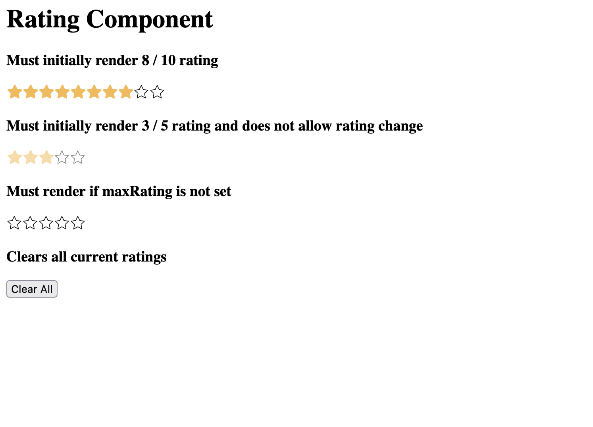

## Starting up and running the application
`yarn install`

`yarn dev`

(Check the terminal for the localhost path)

## Objectives
Check the image for the desired output

Please scan through comment like `YOUR CODE HERE` in the files and add your code accordingly

1. Rating component should render
2. Rating component should change ratings
3. Rating component should have necessary defaults in place
4. Rating component should look like the ratings in the image attached
